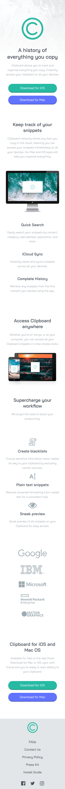

# Frontend Mentor - Clipboard landing page solution

This is a solution to the [Clipboard landing page challenge on Frontend Mentor](https://www.frontendmentor.io/challenges/clipboard-landing-page-5cc9bccd6c4c91111378ecb9). Frontend Mentor challenges help you improve your coding skills by building realistic projects. 

## Overview

### Links

- Solution URL: [Github](https://github.com/Affan840/Clipboard-Landing-Page)
- Live Site URL: [Live Preview](https://affan840.github.io/Clipboard-Landing-Page/)

### Screenshot

## Desktop

## Mobile

### Built with

- Semantic HTML5 markup
- CSS custom properties
- Flexbox
- JavaScript

## Author

- Instagram - [@muhammad__affan07](https://www.instagram.com/muhammad__affan07/)